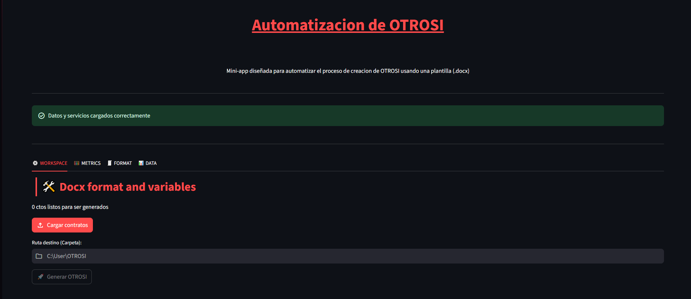
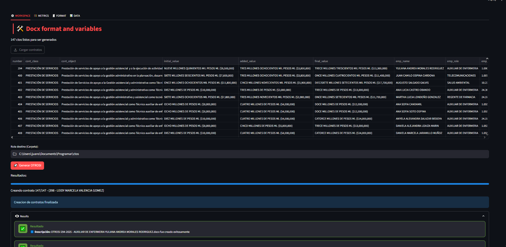
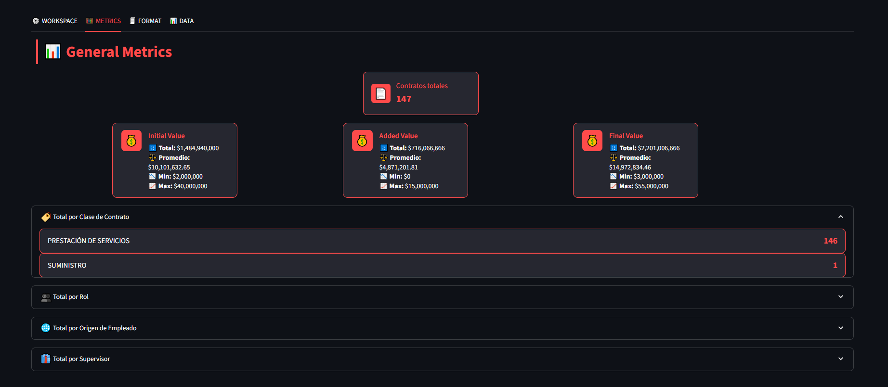
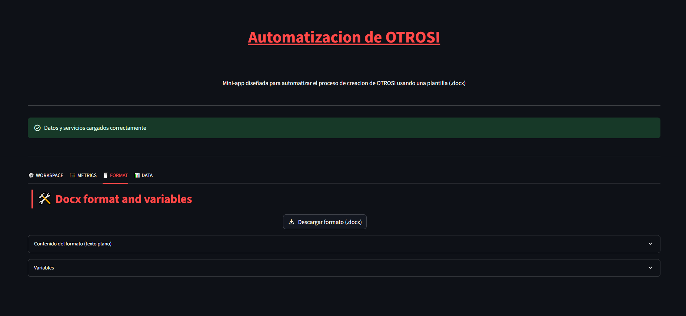
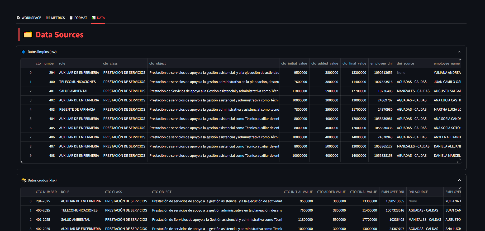

# 📄 Automatización de Documentos OTROSI - OTROSI Automation

Mini aplicación web desarrollada con [Streamlit](https://streamlit.io/) para una **empresa específica**, diseñada para generar documentos **OTROSI** con variables personalizadas requeridas por los contratos de la compañía. Permite seleccionar la ruta de destino y crear automáticamente los documentos DOCX a partir de la plantilla, mostrando progreso y resultados acumulativos de manera interactiva.

Web mini app developed with [Streamlit](https://streamlit.io/) for a **specific company**, created to generate **OTROSI** documents with custom variables required in the contracts. The app allows selecting a destination path and automatically generates DOCX files from the template while displaying interactive progress and accumulated results.

---

## 🚀 Funcionalidades principales - Main Features

- Carga de datos y plantilla en carpeta DataSources, en donde se limpian para cumplir con las variables.  
- Visualización interactiva de los objetos de contratos que serán generados en un **DataFrame**.  
- Validación automática de la ruta destino.  
- Generación de archivos DOCX con variables específicas para la empresa.  
- Barra de progreso que indica el avance de la creación de documentos.  
- Resultados acumulativos mostrados en tarjetas dentro de un **expander**.  
- Interfaz limpia y modular, pensada para flujos de trabajo rápidos y eficientes.  
- Sección de Metrics en la cual se recolecta información general (ej. total dinero agregado, conteo por clase de contrato, role, etc).  
- Sección de Format en la cual se muestran las variables y el template (como texto plano), permitiendo descargar el template como .docx con todos sus estilos, tablas, etc.  
- Sección de Data en la cual, en dos **expander** con **DataFrame**, se muestran los datos sin procesar y los datos finales ya limpios.  

 

- Load contracts and template into folder DataSources, where they are cleaned to match the required variables.  
- Interactive visualization of contract objects that will be generated in a **DataFrame**.  
- Automatic destination path validation.  
- Generation of DOCX files with company-specific variables.  
- Progress bar showing the status of document creation.  
- Accumulated results displayed in cards inside an **expander**.  
- Clean and modular interface designed for fast and efficient workflows.  
- Metrics section collecting general information (e.g., total money added, count by contract type, role, etc).  
- Format section showing the variables and the template (as plain text), allowing download of the template as a .docx with all its styles and tables.  
- Data section showing raw and cleaned data in two **expanders** with **DataFrames**.  

---

## 🛠️ **Librerías usadas - Libraries Used**
- Streamlit  
- Pandas  
- Typing  
- docxtpl
- docx
- num2words
- os
- io

---

## 🛠️ Proceso de instalación - Installation step-by-step

1. Clonar este repositorio o descargar el proyecto (borrar otros proyectos).
2. Tener Python 3.11+ instalado.
3. Instalar las dependencias necesarias mencionadas en la seccion anterior.
4. Navegar a la carpeta principal del proyecto (automation_st_OTROSI) y ejecutar:
        streamlit run main.py

(💡 Si pip install o streamlit run lanzan error prueba anteponiendo: py o py -m)

1. Clone this repository or download the project (delete other projects).
2. Make sure you have Python 3.11+ installed.
3. Install the required dependencies mentioned in the prevous section.
4. Navigate to the main project folder (automation_st_OTROSI) and run:
        streamlit run main.py

(💡 If pip install or streamlit run throws an error, try prefixing the command with py or py -m)

---

# 🖼️ Previsualizaciones - Previews

(💡 Algunas imagenes pueden perder calidad debido a que fueron redimensionadas)
(💡 Some images may lose quality because they were resized)

## GLOBAL INTERFACE

## MAIN SECTION

## METRICS SECTION

## FORMAT SECTION

## DATA SECTION

